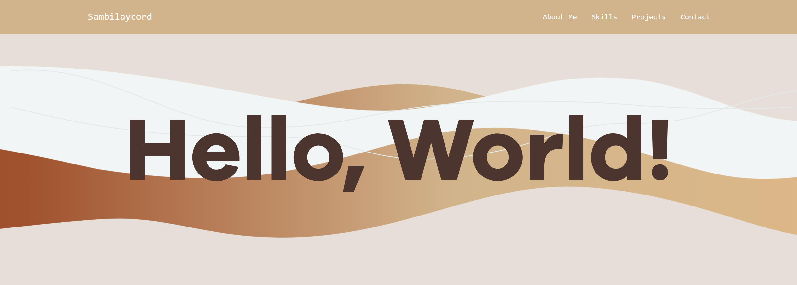

# ePortfolio

## Description

Welcome to my ePortfolio! This project is a personal portfolio website where I showcase my skills, projects, and accomplishments. 



The ePortfolio includes sections such as **About Me**, **Projects**, **Skills**, and **Contact Information**, providing a detailed overview of my professional background and capabilities. The website is designed to be clean, responsive, and easy to navigate, highlighting my work and achievements in an organized and interactive format.

Key features include:
- A dynamic navbar that changes style on scroll.
- Smooth scrolling for navigating between sections.
- Active link highlighting as you scroll through sections.
- Mobile-responsive design for optimal viewing across all devices.

## Technologies Used

This ePortfolio was built using the following technologies:
- **HTML5**: For structuring the content and layout of the page.
- **CSS3**: For styling the website, including responsive design using media queries.
- **JavaScript**: To add interactivity such as smooth scrolling, active link highlighting, and scroll-based navbar styling.
- **Bootstrap**: Used for building a responsive navigation bar and layout (if applicable).
  
## Instructions to Replicate

To replicate or contribute to this project, follow these steps:

### 1. Clone the Repository
To get a copy of the repository on your local machine, use the following command:
```bash
git clone https://github.com/your-username/eportfolio.git